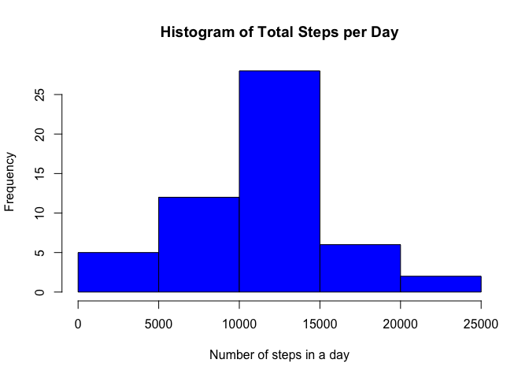
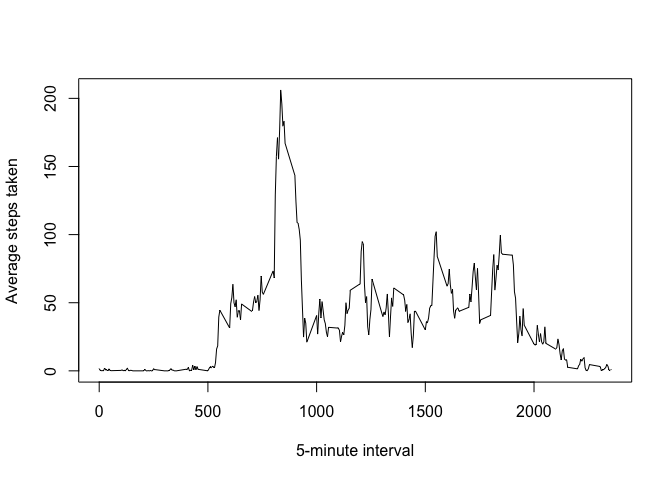
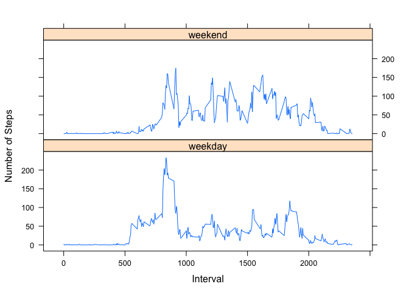

# Reproducible Research: Peer Assessment 1


## Loading and preprocessing the data


```r
activity <- read.csv(unz('activity.zip','activity.csv'))
```

## What is mean total number of steps taken per day?

Calculate the total number of steps for each day. 


```r
daily <- aggregate(steps~date, data=activity, FUN="sum",na.rm=TRUE)
```

Histogram of total number of steps taken each day.


```r
hist(daily$steps,
     main="Histogram of Total Steps per Day",
     xlab='Number of steps in a day',
     col='blue')
```

<!-- -->

Calculate the mean number of steps taken per day. 


```r
mean(daily$steps)
```

```
## [1] 10766.19
```

Calculate the median number of steps taken per day. 


```r
median(daily$steps)
```

```
## [1] 10765
```

## What is the average daily activity pattern?

Calculate the averages for each interval. 


```r
intervals <- aggregate(steps~interval,data=activity, FUN="mean",na.rm=TRUE)
```


Time series plot of the 5-minute interval (x-axis) and the average number of steps taken, averaged across all days (y-axis)


```r
with(intervals,
     plot(interval,steps, type='l', xlab='5-minute interval', ylab='Average steps taken'))
```

<!-- -->

Find which 5-minute interval, on average across all the days in the dataset, contains the maximum number of steps.


```r
intervals[which.max(intervals$steps),]
```

```
##     interval    steps
## 104      835 206.1698
```


## Imputing missing values

Calculate the total number of missing values in the dataset. 


```r
sum(is.na(activity$steps))
```

```
## [1] 2304
```

Fill in missing values with the mean value for that 5-minute interval, taken from the intervals data frame that was calculated earlier. 


```r
activity_imp <- activity

activity_imp$steps[is.na(activity_imp$steps)] <-
    intervals[intervals$interval==(activity_imp$interval[is.na(activity_imp$steps)]),'steps']
```


Calculate the total number of steps for each day with missing values imputed. 


```r
daily_no_na <- aggregate(steps~date, data=activity_imp, FUN="sum")
```

Histogram of total number of steps taken each day.


```r
hist(daily_no_na$steps,
     main="Histogram of Total Steps per Day",
     xlab='Number of steps in a day',
     col='blue')
```

<!-- -->

Calculate the mean number of steps taken per day. 


```r
mean(daily_no_na$steps)
```

```
## [1] 10766.19
```

Calculate the median number of steps taken per day. 


```r
median(daily_no_na$steps)
```

```
## [1] 10765.59
```
When missing values are replaced by the mean value for each 5-minute interval, the total number of steps increases slightly, but the mean and median estimated values do not change compared to when the missing values are ignored. 

## Are there differences in activity patterns between weekdays and weekends?

Create a new factor variable in the dataset with two levels -- "weekday" and "weekend" indicating whether a given date is a weekday or weekend day.

First, define weekdays and weekends, starting with a list of all of the days starting at Monday. 


```r
all.days <- weekdays(as.Date(4,"1970-01-01",tz="GMT")+0:6)
wkdays <- all.days[1:5]
wkends <- all.days[6:7]
```

Now, create the new factor.


```r
activity_imp[weekdays(as.POSIXct(activity_imp$date)) %in% wkdays,'day.type'] <- "weekday"
activity_imp[weekdays(as.POSIXct(activity_imp$date)) %in% wkends,'day.type'] <- "weekend"
```

Compute the average number of steps for each 5-minute interval across weekdays and weekends. 


```r
intervals.by.day <- aggregate(steps ~ interval + day.type, data = activity_imp, FUN= "mean" )
```

Time series plots of average number of steps for each 5-minute interval on weekdays and weekends. 


```r
library(lattice)

xyplot(steps~interval|day.type,data=intervals.by.day,type='l',layout=c(1,2),
       xlab="Interval",ylab="Number of Steps")
```

<!-- -->

On weekends, more activity is detected throughout the daytime. On weekdays there are spikes in activity in the morning and evening, and less activity during working hours. 
